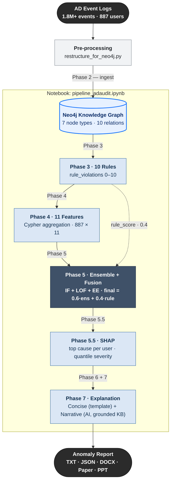

# Explainable Anomaly Detection in Active Directory

**Judul paper (IJIES):** *Explainable Anomaly Detection in Active Directory: Integrating a Rule-Based Knowledge Engine, Ensemble Learning, and SHAP for Human-Readable Reasoning*

Sistem deteksi anomali perilaku pengguna Active Directory berbasis Knowledge Graph (Neo4j), Rule Engine, dan Ensemble Machine Learning (IF + LOF + EE) dengan explainability SHAP, ditutup dengan penjelasan anomali yang dapat dibaca manusia (Phase 7, grounded ke knowledge base).

## Arsitektur Pipeline

Diagram berikut ter-render otomatis di GitHub dan preview Markdown VS Code (format Mermaid). Penjelasan asal-usul data lengkap ada di [`docs/PENJELASAN_FITUR.md`](docs/PENJELASAN_FITUR.md).

> Flowchart lengkap (berstage, dengan titik keputusan & fallback Phase 7): [`docs/ALUR_PROJECT.md`](docs/ALUR_PROJECT.md).



---

## Prasyarat

### Software

| Software | Versi | Keterangan |
| ---------- | ------- | ------------ |
| Python | 3.10+ | Direkomendasikan 3.12 |
| Neo4j | 5.x | Community atau Enterprise |
| Jupyter | 1.0+ | Untuk menjalankan notebook |

### Instalasi dependensi Python

```bash
pip install -r requirements.txt
```

Atau gunakan setup script (Linux/Mac):

```bash
bash setup.sh
```

Dependensi utama: `neo4j`, `pandas`, `numpy`, `scikit-learn`, `shap`, `scipy`, `matplotlib`, `python-docx`

---

## Konfigurasi

Edit bagian konfigurasi di **`pipeline_adaudit.ipynb`** (cell kedua) atau langsung di masing-masing script:

```python
NEO4J_URI      = "bolt://localhost:7687"
NEO4J_USER     = "neo4j"
NEO4J_PASSWORD = "lalarasa"          # ganti dengan password Neo4j Anda

DATA_CSV = "data/restructured_data/unified_logon_events.csv"
```

Pastikan Neo4j sudah berjalan sebelum menjalankan pipeline:

- **Desktop**: buka Neo4j Desktop → klik **Start**
- **Service**: `neo4j start` atau `net start neo4j`
- **Verifikasi**: buka `http://localhost:7474` di browser

> **Reproducibility:** Phase 2 otomatis mereset database (`CREATE OR REPLACE DATABASE`) di awal tiap run, sehingga hasil selalu identik untuk input yang sama. Model ML memakai `random_state=42`.

---

## Struktur Data Input

Letakkan file CSV raw di folder `data/raw_data/`. Pra-proses (`restructure_for_neo4j.py`) menggabungkannya menjadi:

| File hasil | Keterangan |
| ------------ | ------------ |
| `data/restructured_data/unified_logon_events.csv` | Event logon gabungan (1.8 juta+ events) |
| `data/restructured_data/account_lockouts.csv` | Event lockout akun |
| `data/restructured_data/privileged_actions.csv` | Aksi admin/privileged |

---

## Cara Menjalankan

### Opsi 1 — Jupyter Notebook (Direkomendasikan)

```bash
jupyter notebook pipeline_adaudit.ipynb
```

Jalankan cell berurutan dari atas ke bawah. Setiap phase punya cell markdown penjelasan + cell kode. Bagian bawah notebook berisi **Review Hasil** dan **Ablation Study** (perbandingan IF/LOF/EE + akurasi 7 konfigurasi).

### Opsi 2 — Script Python Langsung

```bash
python neo4j_ingest_phase2.py      # Phase 2: Ingest ke Neo4j (lama, ~30 menit)
python neo4j_phase3_rules.py       # Phase 3: 10 domain rules
python neo4j_phase4_features.py    # Phase 4: 11 graph features
python neo4j_phase5_anomaly.py     # Phase 5: Ensemble anomaly detection
python neo4j_phase55_shap.py       # Phase 5.5: SHAP explainability
python neo4j_phase6_reporting.py   # Phase 6: Generate laporan
```

### Generate dokumen (opsional)

```bash
python generate_report_docx_v3.py  # Laporan DOCX lengkap (12 section)
python generate_paper_ijies.py     # Draft paper format IJIES
python generate_ppt_outline_v4.py  # Outline presentasi (22 slide + 7 gambar)
```

---

## Detail Setiap Phase

### Phase 2 — Neo4j Ingestion

**Script:** `neo4j_ingest_phase2.py`
**Output:** Neo4j graph (~680K nodes, ~710K relationships)

**7 Node types:** `User`, `Hostname`, `Server`, `IPAddress`, `Service`, `Group`, `Event`

Relationship types:

| Relationship | Dari → Ke | Keterangan |
| ------------- | ----------- | ------------ |
| `LOGIN_FROM` | User → Hostname | Logon dari workstation |
| `AUTHENTICATED_VIA` | User → Server | Autentikasi ke server |
| `FAILED_LOGIN` | User → Server | Login gagal |
| `CONNECTED_FROM` | User → IPAddress | Koneksi dari IP |
| `USED_IP` | Hostname → IPAddress | Workstation memakai IP |
| `USED_SERVICE` | User → Service | Menggunakan layanan |
| `MEMBER_OF` | User → Group | Anggota grup |
| `REFERENCES` | Event → User | Event merujuk user |
| `LOCKED_OUT` | User → Server | Event lockout (auxiliary) |
| `ADMIN_ACTION_ON` | User → target | Aksi admin (auxiliary) |

> **Estimasi waktu:** ~30 menit untuk 1.8 juta events. Database direset otomatis di awal (reproducible).

---

### Phase 3 — Rule-Based Knowledge Engine

**Script:** `neo4j_phase3_rules.py`
**Output:** Property `rule_violations` (0–10) + flag per rule pada node User

| Rule | Nama | Kondisi Anomali |
| ------ | ------ | ---------------- |
| R001 | Multi-host login | Login dari > 3 host unik |
| R002 | Off-hours login | > 10% login di luar jam 08:00–18:00 |
| R003 | Shared device | Device dipakai > 5 user berbeda |
| R004 | Critical server access | Akses ke Domain Controller / server CRITICAL |
| R005 | Failed login spike | > 50 kali login gagal |
| R006 | Unusual IP | IP di luar Office/VPN |
| R007 | After-hours privileged | Admin akses DC di luar jam kerja |
| R008 | Frequent lockouts | User sering lockout |
| R009 | Excessive admin actions | Banyak admin action |
| R010 | Sensitive group membership | Anggota grup sensitif |

> Catatan: pada dataset ini R006, R007, R010 tidak ter-trigger (tidak ada pola tersebut / keterbatasan data) — ini temuan, bukan kelemahan.

---

### Phase 4 — Graph Feature Extraction

**Script:** `neo4j_phase4_features.py`
**Output:** `data/phase4_graph_features.csv` (887 user × 11 fitur)

**Fitur dasar (8):**

| Fitur | Keterangan |
| ------- | ----------- |
| `host_diversity` | Jumlah host unik relatif terhadap rata-rata |
| `critical_server_ratio` | Proporsi akses ke server kritikal |
| `failure_ratio` | Intensitas login gagal: Σ login gagal ÷ jumlah relasi `LOGIN_FROM` (bisa ≫ 1 — **bukan** rasio 0–1) |
| `shared_device_risk` | Rata-rata user per device yang diakses |
| `ip_network_risk` | Proporsi IP di luar jaringan kantor/VPN |
| `privilege_level` | Level privilege tertinggi (1–4) |
| `connectivity` | Degree centrality dalam graph |
| `rule_violations` | Jumlah rule yang dilanggar (0–10) |

**Fitur tambahan (3):**

| Fitur | Keterangan |
| ------- | ----------- |
| `lockout_count` | Jumlah lockout event per user |
| `admin_actions` | Jumlah admin action per user |
| `sensitive_groups` | Keanggotaan grup sensitif |

---

### Phase 5 — Ensemble Anomaly Detection

**Script:** `neo4j_phase5_anomaly.py`
**Output:** `data/phase5_anomaly_results.csv`, `data/phase5_anomalies_summary.csv`, `models/`

Tiga algoritma unsupervised digabungkan (contamination = 0.05):

| Model | Metode | Kekuatan |
| ------- | -------- | --------- |
| Isolation Forest (IF) | Random partitioning | Anomali global ekstrem |
| Local Outlier Factor (LOF) | Density-based | Anomali lokal di cluster |
| Elliptic Envelope (EE) | Robust covariance | Outlier statistik multivariat |

**Formula skor akhir:**

```
final_score = 0.60 × (ensemble_votes / 3) + 0.40 × (rule_violations / 10)
```

**Kriteria anomali:** ≥ 2 dari 3 model setuju, atau severity ≥ MEDIUM.

**Klasifikasi severity (quantile-based, data-driven):**

| Severity | Threshold | Persentil |
| ---------- | ----------- | ----------- |
| CRITICAL | ≥ P99 | Top 1% |
| HIGH | ≥ P95 | Top 5% |
| MEDIUM | ≥ P90 | Top 10% |
| LOW | ≥ P75 | Top 25% |
| NORMAL | < P75 | Sisanya |

> Threshold quantile dipilih agar objektif/reproducible (bukan angka arbitrary), selaras dengan contamination rate. Referensi: Aggarwal (2017), Goldstein & Uchida (2016), Liu et al. (2008).

Model tersimpan di `models/`: `isolation_forest_model.pkl`, `lof_model.pkl`, `elliptic_envelope_model.pkl`, `feature_scaler.pkl`.

---

### Phase 5.5 — SHAP Explainability

**Script:** `neo4j_phase55_shap.py`
**Output:** `data/phase55_shap_values.csv`, `data/phase55_shap_anomalies.csv`

Menggunakan `shap.TreeExplainer` (native untuk Isolation Forest). Setiap user mendapat nilai SHAP per fitur + `top_feature_1/2/3` (penyebab utama) dengan label Bahasa Indonesia. Hasil ditulis kembali ke Neo4j (`shap_top_feature`, `shap_top_feature_label`, dll).

---

### Phase 6 — Reporting

**Script:** `neo4j_phase6_reporting.py`
**Output:**

| File | Format | Isi |
| ------ | -------- | ----- |
| `output/anomaly_detection_report.txt` | Teks | Executive summary, top anomali, rekomendasi |
| `output/anomaly_detection_detailed.json` | JSON | 50 anomali teratas + evidence + SHAP |
| `output/anomaly_statistics.json` | JSON | Distribusi severity, statistik fitur |
| `output/AD_Anomaly_Detection_Report_v3.docx` | Word | Laporan formal (12 section, dibuat oleh `generate_report_docx_v3.py`) |

---

## Ablation Study

Notebook menyertakan ablation study untuk menjustifikasi penggunaan ensemble:

- **Perbandingan IF vs LOF vs EE** — detection count, overlap (Venn), Jaccard, Cohen's Kappa, Precision@K.
- **Akurasi 7 konfigurasi** — IF, LOF, EE, IF+LOF, IF+EE, LOF+EE, IF+LOF+EE (Accuracy/Precision/Recall/F1 vs proxy ground truth `rule_violations`).
- **Analisis sensitivitas** — menunjukkan ensemble penuh konsisten robust (tidak pernah terburuk).

> Catatan: karena unsupervised (tanpa label asli), akurasi dihitung terhadap **proxy** berbasis `rule_violations` — bersifat *weak supervision*, bukan akurasi absolut.

---

## Struktur Folder

```
tdas_adauditv3/
├── pipeline_adaudit.ipynb          # Notebook utama (pipeline + ablation study)
│
├── neo4j_ingest_phase2.py          # Phase 2: Neo4j ingestion (+ reset DB)
├── neo4j_phase3_rules.py           # Phase 3: 10 rule engine
├── neo4j_phase4_features.py        # Phase 4: 11 feature extraction
├── neo4j_phase5_anomaly.py         # Phase 5: ensemble + quantile severity
├── neo4j_phase55_shap.py           # Phase 5.5: SHAP explainability
├── neo4j_phase6_reporting.py       # Phase 6: reporting
│
├── restructure_for_neo4j.py        # Pra-proses: gabung CSV raw
├── generate_report_docx_v3.py      # Laporan DOCX (12 section)
├── generate_paper_ijies.py         # Draft paper format IJIES
├── generate_ppt_outline_v4.py      # Outline presentasi (22 slide + 7 gambar)
├── requirements.txt                # Dependensi Python
├── setup.sh                        # Setup script (Linux/Mac)
│
├── data/
│   ├── raw_data/                   # CSV mentah dari AD
│   ├── restructured_data/          # CSV gabungan
│   ├── phase4_graph_features.csv   # Output Phase 4
│   ├── phase5_anomaly_results.csv  # Output Phase 5
│   └── phase55_shap_*.csv          # Output Phase 5.5
│
├── models/                         # Model ML tersimpan (.pkl)
├── output/                         # Laporan akhir + paper
├── cypher/                         # Query Cypher untuk Neo4j Browser
└── docs/                           # Dokumentasi, referensi, presentasi
    ├── PANDUAN_PRESENTASI_DAN_PENGGUNAAN.md   # Panduan presentasi (Q&A dosen) + cara pakai
    ├── TESTING_NEO4J.md                       # Query verifikasi per-phase + angka kanonik
    ├── references/                            # Paper referensi (PDF)
    └── presentations/                         # Outline & file presentasi (v4)
```

---

## Dokumentasi Pendukung

| Dokumen | Isi |
| --------- | ----- |
| [`docs/HYBRID_REASONING.md`](docs/HYBRID_REASONING.md) | **Konsep inti (novelty):** penggabungan Rule-Based Knowledge Engine + Explainable AI (SHAP) → deteksi anomali dengan penalaran (diagram konseptual + teknis + worked example) |
| [`docs/PHASE7_EXPLAINER.md`](docs/PHASE7_EXPLAINER.md) | Desain **Phase 7**: penjelasan anomali human-readable (knowledge base + OpenAI), grounding, anti-halusinasi, & evaluasi |
| [`docs/ALUR_PROJECT.md`](docs/ALUR_PROJECT.md) | **Flowchart project end-to-end** + narasi per-STAGE + tabel I/O tiap phase (terverifikasi dari kode) |
| [`docs/diagrams/README.md`](docs/diagrams/README.md) | Penjelasan **diagram pipeline** (`alur_project` detail vs `paper_pipeline` Figure 1 paper) + sumber `.mmd` & cara re-render |
| [`docs/REFERENCES.md`](docs/REFERENCES.md) | Daftar **referensi paper bertaut** (DOI/arXiv) — terbaru 2021–2026, diprioritaskan IEEE, terverifikasi Crossref |
| [`docs/PENJELASAN_FITUR.md`](docs/PENJELASAN_FITUR.md) | Penjelasan 11 fitur, asal-usul data (lineage), & cara baca visualisasi SHAP (bar chart + beeswarm) |
| [`docs/PANDUAN_PRESENTASI_DAN_PENGGUNAAN.md`](docs/PANDUAN_PRESENTASI_DAN_PENGGUNAAN.md) | Panduan presentasi lengkap: alur slide, konsep wajib dikuasai, antisipasi pertanyaan dosen, + cara penggunaan pipeline |
| [`docs/TESTING_NEO4J.md`](docs/TESTING_NEO4J.md) | Query Cypher siap pakai untuk verifikasi tiap phase di Neo4j Browser, dengan angka kanonik acuan |
| `docs/presentations/PPT_Outline_TDAS_AD_Audit_v4.docx` | Outline presentasi 22 slide + 7 gambar (dinamis dari data kanonik) |

---

## Troubleshooting

### Neo4j tidak bisa terhubung / crash saat operasi besar

Pastikan Neo4j berjalan dan kredensial benar. Instance dengan heap kecil bisa crash saat operasi besar — naikkan `server.memory.heap.max_size` di `neo4j.conf` (mis. `2G`).

### Error Cypher syntax di Phase 3/4

Pastikan **Neo4j 5.x**. Script memakai sintaks terbaru: `datetime(x).hour`, `COUNT { (pattern) }`, `NOT x IN list`, `CALL { } IN TRANSACTIONS`.

### SHAP error: model not found

Jalankan Phase 5 dulu sehingga `models/isolation_forest_model.pkl` ada.

### Encoding error di Windows

```bash
set PYTHONIOENCODING=utf-8
python neo4j_phase6_reporting.py
```

---

## Output Contoh (data kanonik)

```
ANOMALY DETECTION REPORT
========================
Total users analyzed : 887
Anomalies (MEDIUM+)  : 89
  CRITICAL           : 9
  HIGH               : 36
  MEDIUM             : 44
  LOW                : 133
  NORMAL             : 665

Top Anomalous Users:
  mti.admin          Score: 0.6400  Severity: CRITICAL  Cause: Sering lockout
  andre.saputra      Score: 0.3925  Severity: CRITICAL  Cause: Banyak admin action
  mahathir.muhammad  Score: 0.3914  Severity: CRITICAL  Cause: Banyak admin action
  ...
```

---

## Lisensi

Proyek ini dikembangkan untuk keperluan audit keamanan internal.
