# Flowchart Project — AD Audit Anomaly Detection

Diagram utama alur project end-to-end, dari log mentah Active Directory sampai laporan & dokumen akhir. Mermaid akan **ter-render otomatis** di GitHub dan preview Markdown VS Code.

> Konsep penggabungan Rule-Based + SHAP (novelty): [HYBRID_REASONING.md](HYBRID_REASONING.md). Penjelasan fitur & SHAP: [PENJELASAN_FITUR.md](PENJELASAN_FITUR.md). Arsitektur ringkas: [../README.md](../README.md).

---

## Flowchart Utama (end-to-end)

> 🖼️ Versi gambar siap-pakai (untuk paper/PPT/sidang): [`diagrams/alur_project.png`](diagrams/alur_project.png) · [`diagrams/alur_project.svg`](diagrams/alur_project.svg) — di-render dari sumber [`diagrams/alur_project.mmd`](diagrams/alur_project.mmd). Re-render: `npx @mermaid-js/mermaid-cli -i docs/diagrams/alur_project.mmd -o docs/diagrams/alur_project.png -b white -s 2`.

```mermaid
flowchart TB
    %% ===== NODES =====
    DATA(["<b>Active Directory Event Logs</b><br/>1.8M+ events · 887 users · target: anomalous users"]):::terminal
    PRE["<b>PRE-PROCESSING</b><br/>restructure_for_neo4j.py<br/>raw → restructured (3 csv)"]:::pre
    GRAPH[("<b>Neo4j Knowledge Graph</b><br/>Phase 2 · 7 node types · 10 relations")]:::kg

    RULES["<b>Phase 3 · Rule Engine</b><br/>10 domain rules → rule_violations 0–10"]:::proc
    FEAT["<b>Phase 4 · Feature Extraction</b><br/>Cypher aggregation · 887 × 11 features"]:::proc

    IF["<b>Isolation Forest</b><br/>contamination 5%"]:::proc
    LOF["<b>Local Outlier Factor</b><br/>density-based"]:::proc
    EE["<b>Elliptic Envelope</b><br/>covariance-based"]:::proc
    ENS["<b>Ensemble Vote</b><br/>ensemble_anomaly_score"]:::accent
    FUSE["<b>SCORE FUSION</b><br/>final = 0.6 × ensemble + 0.4 × rule"]:::accent

    SHAP["<b>Phase 5.5 · SHAP TreeExplainer</b><br/>beeswarm + bar · on IF sub-model"]:::proc
    SEV["<b>Quantile Severity</b><br/>P99 CRITICAL · P95 HIGH · P90 MEDIUM · P75 LOW"]:::proc
    DANOM{"Anomalous user?<br/>severity ≥ threshold"}:::decision

    T1["<b>Concise Explanation (template)</b><br/>KB-based · deterministic · always runs"]:::proc
    DKEY{"OPENAI_API_KEY<br/>available?"}:::decision
    T2["<b>Narrative Explanation (AI)</b><br/>OpenAI gpt-4o-mini · T=0.2 · grounded to KB"]:::proc
    DOK{"AI output valid?<br/>strict JSON schema"}:::decision
    FBK["fallback:<br/>use Concise Explanation"]:::danger
    FINAL["<b>Per-anomaly explanation</b><br/>concise + narrative + MITRE / Event ID sources"]:::proc

    NORMAL["normal user<br/>(not explained)"]:::pre
    REPORT(["<b>ANOMALY REPORT</b><br/>ranked · explained · MITRE-linked<br/>TXT · JSON · DOCX · Paper · PPT"]):::terminal

    %% --- output artifacts (parallelogram) ---
    O_RULE[/"rule_violations<br/>rule-based score"/]:::output
    O_FEAT[/"phase4_graph_features.csv<br/>887 × 11"/]:::output
    O_SCORE[/"phase5_anomaly_results.csv<br/>score + severity"/]:::output
    O_SHAP[/"phase55_shap_*.csv<br/>top cause per user"/]:::output

    %% ===== EDGES (fixed order — referenced by linkStyle below) =====
    DATA --> PRE
    PRE --> GRAPH
    GRAPH -->|"Phase 3 · 10 rules"| RULES
    RULES -->|"Phase 4 · 11 features"| FEAT
    FEAT --> IF
    FEAT --> LOF
    FEAT --> EE
    IF --> ENS
    LOF --> ENS
    EE --> ENS
    ENS --> FUSE
    FUSE --> SHAP
    SHAP --> SEV
    SEV --> DANOM
    DANOM -->|"yes — anomaly"| T1
    T1 --> DKEY
    DKEY -->|"yes"| T2
    T2 --> DOK
    DOK -->|"yes — valid"| FINAL
    FINAL --> REPORT
    RULES -.-> O_RULE
    FEAT -.-> O_FEAT
    FUSE -.-> O_SCORE
    SHAP -.-> O_SHAP
    IF -. "TreeExplainer" .-> SHAP
    RULES -. "rule_score · weight 0.4" .-> FUSE
    DANOM -->|"no"| NORMAL
    DKEY -->|"no — offline"| FBK
    DOK -->|"no — failed"| FBK
    FBK -.->|"use template"| FINAL
    NORMAL -.-> REPORT

    %% ===== STAGES =====
    subgraph S1 ["STAGE 1 · GRAPH & RULES"]
        GRAPH
        RULES
    end
    subgraph S2 ["STAGE 2 · FEATURES"]
        FEAT
    end
    subgraph S3 ["STAGE 3 · ENSEMBLE DETECTION"]
        IF
        LOF
        EE
        ENS
        FUSE
    end
    subgraph S4 ["STAGE 4 · EXPLAIN & SEVERITY"]
        SHAP
        SEV
        DANOM
    end
    subgraph S5 ["STAGE 5 · NATURALIZATION · Phase 7"]
        T1
        DKEY
        T2
        DOK
        FBK
        FINAL
    end

    %% ===== STYLE =====
    classDef terminal fill:#2b2b2b,stroke:#111111,color:#ffffff,font-weight:bold
    classDef pre fill:#f1f3f5,stroke:#868e96,color:#212529
    classDef kg fill:#e7f1ff,stroke:#0d6efd,stroke-width:2px,color:#0b2e6b
    classDef proc fill:#dbe7f5,stroke:#3a6ea5,color:#13314f
    classDef accent fill:#3f5168,stroke:#243447,color:#ffffff,font-weight:bold
    classDef decision fill:#3f5168,stroke:#243447,color:#ffffff,font-weight:bold
    classDef output fill:#fff8e1,stroke:#d39e00,color:#5c4500
    classDef danger fill:#fdecea,stroke:#c0392b,color:#7b1f17,font-weight:bold

    linkStyle 20,21,22,23 stroke:#d39e00,stroke-width:1.5px
    linkStyle 26,27,28,29 stroke:#c0392b,stroke-width:2px

    style S1 fill:#f8fafc,stroke:#cbd5e1,color:#334155
    style S2 fill:#f8fafc,stroke:#cbd5e1,color:#334155
    style S3 fill:#f8fafc,stroke:#cbd5e1,color:#334155
    style S4 fill:#f8fafc,stroke:#cbd5e1,color:#334155
    style S5 fill:#f8fafc,stroke:#cbd5e1,color:#334155
```

---

## Legenda

| Warna / Bentuk | Arti |
| --- | --- |
| ⬛ **Hitam (stadium)** | Titik awal (log AD) & titik akhir (laporan anomali). |
| 🔵 **Biru (silinder)** | Neo4j Knowledge Graph — pusat data. |
| 🟦 **Biru muda (kotak)** | Proses tiap fase (rule, fitur, model, SHAP, severity, penjelasan). |
| ⬛ **Slate gelap** | Langkah agregasi inti (Ensemble Vote, Score Fusion) & **titik keputusan** (diamond). |
| 🟨 **Kuning (parallelogram)** | Artefak output / file CSV. |
| 🟥 **Merah** | Jalur **negatif / fallback** (normal user, AI offline, AI gagal → pakai template). |

- **Panah penuh** = aliran utama. **Panah putus-putus** = output artefak, kontribusi `rule_score` ke fusi, dan jalur fallback.
- **Empat titik keputusan** (diamond): (1) Anomalous user?, (2) `OPENAI_API_KEY` available?, (3) AI output valid? — semua punya fallback yang aman ke **Concise Explanation (template)**.
- **SHAP menjelaskan sub-model IsolationForest** (panah `TreeExplainer` dari IF), bukan skor final.
- **`rule_score` masuk ke fusi dengan bobot 0,4** (`final = 0.6 × ensemble + 0.4 × rule`).

---

## Penjelasan Alur (narasi per STAGE)

Bagian ini menjelaskan flowchart di atas langkah demi langkah. Tiap **STAGE** memetakan ke satu atau beberapa *phase* pada pipeline.

### Input — Active Directory Event Logs

Pipeline dimulai dari **±1,8 juta event logon AD mentah** (887 user). Skrip pra-proses (`restructure_for_neo4j.py`) menyatukan & merapikan log menjadi 3 CSV di `data/restructured_data/`. Inilah titik masuk kanonik pipeline.

### STAGE 1 — Graph & Rules

- **Phase 2 (ingest):** CSV → **Neo4j Knowledge Graph** (7 tipe node, 10 tipe relasi). Graph menyimpan relasi user–host–server–IP–service–group sebagai *property graph*.
- **Phase 3 (Rule Engine):** 10 aturan domain (R001–R010) dijalankan sebagai query Cypher di atas graph. Tiap user memperoleh `rule_violations` (0–10) → menjadi **rule_score**. Output berupa properti graph sekaligus sinyal yang mudah ditafsirkan. Rule Engine menutup "buta domain" milik model statistik.

### STAGE 2 — Features

- **Phase 4:** agregasi Cypher menghasilkan **11 fitur per user** (887 × 11) → `phase4_graph_features.csv`. Fitur graph (mis. `host_diversity`, `connectivity`) **tidak** dapat dihitung dari CSV baris-per-baris tanpa traversal graph — inilah yang menjustifikasi representasi graph.

### STAGE 3 — Ensemble Detection

- Tiga model *unsupervised* dilatih pada matriks fitur terstandardisasi (**contamination 5%**): **Isolation Forest** (berbasis pohon), **Local Outlier Factor** (berbasis densitas), **Elliptic Envelope** (berbasis kovarians). Ketiganya menangkap tipe anomali yang berbeda (*inductive bias* komplementer).
- **Majority Vote:** user dianggap anomali bila **≥ 2 dari 3** model setuju → `ensemble_anomaly_score`.
- **Score Fusion:** `final = 0.6 × ensemble + 0.4 × rule`. `rule_score` dari STAGE 1 masuk dengan bobot **0,4** (panah putus-putus). Output: `phase5_anomaly_results.csv`.

### STAGE 4 — Explain & Severity

- **Phase 5.5 (SHAP):** TreeExplainer pada **sub-model IsolationForest** menjelaskan kontribusi tiap fitur (beeswarm + bar) → *top cause* per user (`phase55_shap_*.csv`). Catatan: interpretasi memakai **magnitude `|SHAP|`**, bukan arah (lihat bagian 6 [PENJELASAN_FITUR.md](PENJELASAN_FITUR.md)).
- **Quantile Severity:** ambang *data-driven* P99 = CRITICAL, P95 = HIGH, P90 = MEDIUM, P75 = LOW — menghindari ambang sembarang.
- **Keputusan "Anomalous user?":** bila severity < ambang → **normal user** (tidak dijelaskan, jalur merah). Bila ≥ ambang → lanjut ke STAGE 5.

### STAGE 5 — Naturalization (Phase 7)

- **Concise Explanation (template):** selalu jalan; berbasis KB (`knowledge_base/security_kb.yaml`); deterministik; nol halusinasi; offline.
- **Keputusan "OPENAI_API_KEY available?":** bila tidak → cukup tampilkan template (fallback merah).
- **Narrative Explanation (AI):** OpenAI `gpt-4o-mini` (T = 0,2), *grounded* ke KB, *structured output* JSON skema ketat.
- **Keputusan "AI output valid?":** bila gagal/tidak valid → **fallback ke template** (jalur merah). Sumber (MITRE ATT&CK / Event ID) selalu diambil **eksak dari KB**, bukan dikarang LLM.

### Output — Anomaly Report

Hasil akhir: daftar user anomali **ter-ranking**, lengkap dengan penjelasan + sumber (MITRE ATT&CK + Windows Event ID), dalam format **TXT / JSON / DOCX** (Phase 6), serta paper IJIES & outline PPT.

> **Tiga pengaman (fallback)** menjaga pipeline tetap berjalan walau komponen AI tidak tersedia: (1) user non-anomali dilewati, (2) tanpa API key → pakai template, (3) AI error → fallback template. Artinya penjelasan *human-readable* **selalu tersedia dan tetap bersumber**.

---

## Tabel I/O Tiap Tahap (terverifikasi dari kode)

| Tahap | Script | Input | Output |
| --- | --- | --- | --- |
| Pra-proses | `restructure_for_neo4j.py` (+ cleaning di `trash/`) | `data/raw_data/*.csv` | `data/restructured_data/*.csv` (3 file) |
| Phase 2 | `neo4j_ingest_phase2.py` | `restructured_data/` (3 csv) | Neo4j graph (~680K node, ~710K rel) |
| Phase 3 | `neo4j_phase3_rules.py` | Neo4j graph | properti `rule_violations` (0–10) per user |
| Phase 4 | `neo4j_phase4_features.py` | Neo4j graph | `phase4_graph_features.csv` (887 × 11) |
| Phase 5 | `neo4j_phase5_anomaly.py` | `phase4_graph_features.csv` | `phase5_anomaly_results.csv`, `phase5_anomalies_summary.csv`, `models/*.pkl` |
| Phase 5.5 | `neo4j_phase55_shap.py` | features + results + `models/` | `phase55_shap_values.csv`, `phase55_shap_anomalies.csv` (+ tulis balik graph) |
| Phase 6 | `neo4j_phase6_reporting.py` | results + shap_anomalies + Neo4j | `output/*.txt`, `output/*.json` |
| Phase 7 | `phase7_explainer.py` | `phase55_shap_anomalies.csv` + `phase4_graph_features.csv` + `knowledge_base/security_kb.yaml` | `output/phase7_explanations.json` (penjelasan ringkas + naratif per anomali) |
| Dokumen | `generate_report_docx_v3.py`, `generate_paper_ijies.py`, `generate_ppt_outline_v4.py` | output Phase 5/5.5/6 | `.docx`, paper IJIES, outline PPT |

---

## Catatan Penting

- **Notebook hanya menjalankan Phase 2–6.** Tahap pra-proses (`raw_data` → `clean_data` → `restructured_data`) dijalankan script terpisah; titik masuk kanonik pipeline adalah `restructured_data/`.
- **`phase4_graph_features.csv` adalah hasil AGREGASI**, bukan filter baris: 1.8 jt+ event → 887 user (1 baris = 1 user). Detail lineage: [PENJELASAN_FITUR.md](PENJELASAN_FITUR.md) bagian 1b.
- **SHAP menjelaskan sub-model IsolationForest** (bukan langsung skor anomali final). Untuk interpretasi beeswarm, magnitude `|SHAP|` lebih andal daripada arah — lihat [PENJELASAN_FITUR.md](PENJELASAN_FITUR.md) bagian 6.
- **Phase 7 (STAGE 5 · Naturalization)** mengubah anomali jadi penjelasan yang dapat dibaca manusia: `Concise Explanation (template)` selalu jalan (deterministik, nol halusinasi), `Narrative Explanation (AI)` opsional (OpenAI gpt-4o-mini). Keduanya **di-grounding ke `security_kb.yaml`** dan sumber (MITRE/Event ID) diambil **eksak dari KB**, bukan dikarang LLM. Bila tidak ada API key atau output AI gagal validasi, otomatis **fallback ke template**. Detail: [PHASE7_EXPLAINER.md](PHASE7_EXPLAINER.md).
