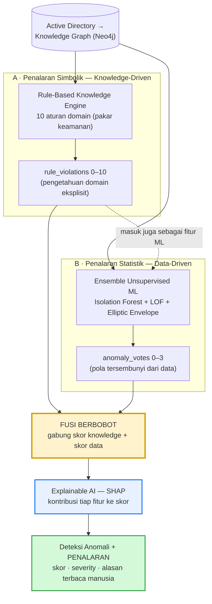
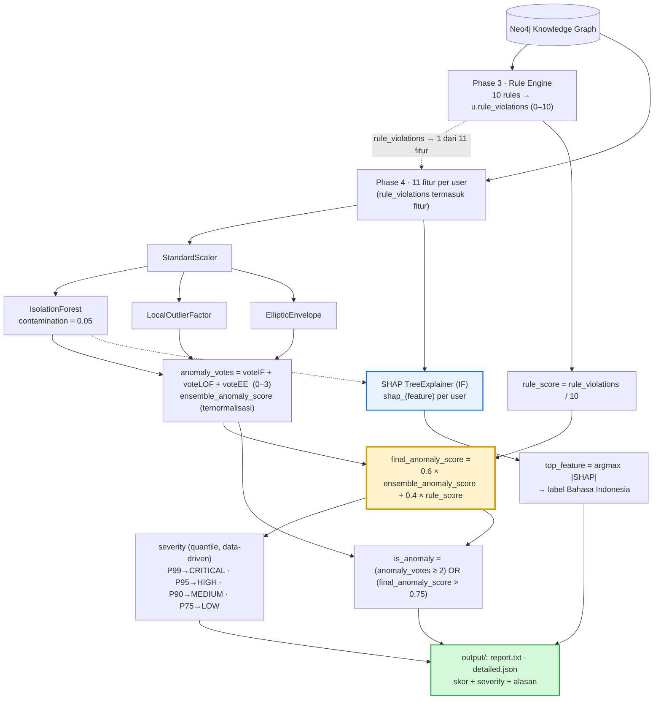

# Hybrid Reasoning: Rule-Based Knowledge Engine + Explainable AI (SHAP)

Dokumen ini menjelaskan **kontribusi inti (novelty)** project: arsitektur *hybrid reasoning* yang menggabungkan **penalaran simbolik berbasis pengetahuan** (Rule-Based Knowledge Engine) dengan **penalaran statistik berbasis data** (Ensemble Machine Learning), lalu memakai **Explainable AI (SHAP)** untuk menghasilkan deteksi anomali yang **akurat sekaligus dapat dijelaskan** (*anomaly detection with reasoning*).

> Diagram pipeline operasional: [ALUR_PROJECT.md](ALUR_PROJECT.md). Penjelasan fitur & SHAP: [PENJELASAN_FITUR.md](PENJELASAN_FITUR.md). Detail aturan: [PHASE3_RULES.md](PHASE3_RULES.md).
>
> **Realisasi lapis penalaran (narasi human-readable) ada di Phase 7:** [PHASE7_EXPLAINER.md](PHASE7_EXPLAINER.md).

---

## 1. Motivasi

Deteksi anomali *unsupervised* murni memiliki dua keterbatasan klasik:

1. **Black box** — model ML (mis. Isolation Forest) memberi skor anomali tanpa alasan yang dapat dipahami analis keamanan.
2. **Mengabaikan pengetahuan domain** — pola pelanggaran yang sudah *diketahui* pakar (mis. login lintas banyak host, akses Domain Controller di luar jam kerja) tidak dimanfaatkan secara eksplisit.

**Solusi:** menggabungkan tiga lapis penalaran yang saling menutup kelemahan:

| Lapis | Paradigma | Kekuatan | Kelemahan yang ditutup |
| --- | --- | --- | --- |
| Rule-Based Knowledge Engine | Simbolik / *knowledge-driven* | Eksplisit, presisi pada pola yang diketahui, mudah ditafsirkan | Menutup "buta domain" milik ML |
| Ensemble ML (IF + LOF + EE) | Statistik / *data-driven* | Menangkap pola anomali yang **tak terduga** | Menutup "kaku" milik rules |
| SHAP (Explainable AI) | XAI *post-hoc* | Memberi **alasan** per user pada skor ML | Menutup "black box" milik ML |

---

## 2. Diagram Konseptual

Menunjukkan **dua aliran penalaran** yang menyatu, lalu dijelaskan oleh SHAP menjadi keputusan + alasan.

**Inti gagasan:** pengetahuan domain (rules) tidak sekadar ditempel di akhir — ia **menyatu** ke dalam ML (sebagai fitur) **dan** ke dalam skor akhir (sebagai bobot), lalu SHAP menerjemahkan hasil numerik menjadi **alasan** yang bisa dibaca analis.

---

## 3. Diagram Teknis (alur + rumus)

Versi rinci dengan nama kolom, rumus, dan ambang — terverifikasi dari [`neo4j_phase5_anomaly.py`](../neo4j_phase5_anomaly.py#L149-L196) dan [`neo4j_phase55_shap.py`](../neo4j_phase55_shap.py#L86-L122).

---

## 4. Tiga Titik Integrasi (kunci novelty)

Pengetahuan domain & ML tidak berjalan terpisah — keduanya terintegrasi di **tiga titik**:

| # | Titik integrasi | Mekanisme | Lokasi kode |
| --- | --- | --- | --- |
| 1 | **Rules → fitur ML** | `rule_violations` menjadi salah satu dari 11 fitur input ensemble | [phase5:50](../neo4j_phase5_anomaly.py#L50) |
| 2 | **Fusi berbobot skor** | `final = 0.6 × skor_ML + 0.4 × (rule_violations/10)` | [phase5:160-165](../neo4j_phase5_anomaly.py#L160-L165) |
| 3 | **SHAP → penalaran** | Kontribusi tiap fitur (termasuk `rule_violations`) dihitung; fitur dengan magnitude SHAP terbesar jadi *alasan* (label berbahasa Indonesia) | [phase55:103-122](../neo4j_phase55_shap.py#L103-L122) |

Titik 1 & 2 membuat pengetahuan pakar **memengaruhi keputusan** secara langsung; titik 3 membuat keputusan itu **bisa dijelaskan**.

---

## 5. Contoh Kasus (worked example): `mti.admin`

Angka nyata dari pipeline (anomali peringkat #1):

| Komponen penalaran | Nilai | Makna |
| --- | --- | --- |
| **A · Rule Engine** | `rule_violations = 6` → `rule_score = 0.6` | Melanggar 6 dari 10 aturan domain |
| **B · ML Ensemble** | `anomaly_votes = 3/3` → `ensemble_anomaly_score ≈ 0.667` | Ketiga model (IF, LOF, EE) sepakat: anomali |
| **Fusi** | `0.6 × 0.667 + 0.4 × 0.6 = 0.64` | `final_anomaly_score = 0.64` |
| **Severity** | `CRITICAL` (≥ P99) | Masuk 1% teratas |
| **C · SHAP (penalaran)** | `top_feature = lockout_count`, `SHAP ≈ −3.27`, label **"Sering lockout"** | `lockout_count = 12.693` → **alasan utama** anomali |

**Pembacaan kalimat:** *"`mti.admin` ditandai CRITICAL (skor 0.64) karena ketiga model ML sepakat anomali dan ia melanggar 6 aturan domain; penyebab dominannya adalah jumlah lockout yang ekstrem (12.693) — `Sering lockout`."*

Inilah output yang tidak bisa diberikan ML murni: bukan sekadar "anomali", tapi **anomali + tingkat + alasan**.

---

## 6. Mengapa Hybrid? (justifikasi untuk paper)

- **Rules sendiri** → presisi pada pola yang diketahui, tetapi **kaku**: hanya menangkap apa yang sudah dirumuskan pakar.
- **ML sendiri** → menangkap pola tak terduga, tetapi **black box** dan mengabaikan pengetahuan domain.
- **SHAP** → menjembatani: memberi *post-hoc explanation* sehingga skor ML bisa dipertanggungjawabkan.
- **Gabungan ketiganya** → deteksi yang **akurat** (data-driven), **grounded** pada pengetahuan domain (knowledge-driven), dan **transparan** (explainable) — tiga sifat yang dibutuhkan sistem audit keamanan yang dipercaya analis.

> Ringkas: *Rule-Based Knowledge Engine* memberi **konteks domain**, *Ensemble ML* memberi **sensitivitas terhadap pola baru**, dan *SHAP* memberi **penalaran** — bersama-sama menghasilkan deteksi anomali yang bisa dijelaskan.
