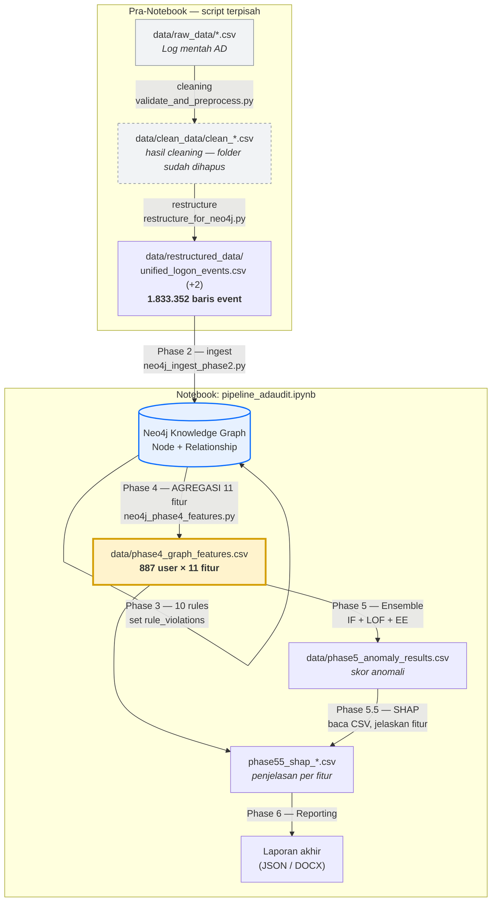

# Dari Mana Asal 11 Fitur? (Penjelasan Sederhana)

Dokumen ini menjelaskan **dari mana fitur ML berasal** dan **bagaimana SHAP memakainya**, dengan bahasa yang mudah dipahami.

> Versi teknis lengkap (query Cypher tiap fitur) ada di [PHASE4_FEATURES.md](PHASE4_FEATURES.md).
> Kode aslinya ada di [`neo4j_phase4_features.py`](../neo4j_phase4_features.py).

---

## 1. Gambaran Besar: Alur Datanya

Fitur **tidak diambil mentah dari log**. Fitur **dihitung dari graph Neo4j**, lalu dipakai model ML, lalu dijelaskan SHAP:

```text
┌──────────┐   ┌─────────────────────┐   ┌──────────────┐   ┌─────────────────────┐   ┌──────┐
│  AD Log  │──▶│  Neo4j Knowledge    │──▶│  Phase 4:    │──▶│  Phase 5: Ensemble  │──▶│ SHAP │
│ (mentah) │   │  Graph (node+relasi)│   │  11 Fitur    │   │  (IF + LOF + EE)    │   │      │
└──────────┘   └─────────────────────┘   └──────────────┘   └─────────────────────┘   └──────┘
                                              │                                            │
                                              ▼                                            ▼
                                  data/phase4_graph_features.csv          "fitur mana yang bikin
                                                                            user ini anomali?"
```

**Inti yang harus dipahami:**
Fitur seperti `host_diversity` atau `shared_device_risk` **tidak mungkin** didapat dari satu baris log saja. Mereka muncul dari **pola hubungan antar entitas** (user ↔ host ↔ server ↔ IP ↔ group) di seluruh graph. Itulah alasan pipeline ini pakai Neo4j dulu, baru Machine Learning. Inilah yang disebut **graph-based features**.

---

## 1a. "Dihitung dari Graph" vs "Dibaca dari CSV" — Jangan Bingung

Ini sering bikin bingung, jadi diperjelas. **Keduanya benar**, hanya beda tahap:

```text
Neo4j Graph ──dihitung──▶ CSV ──dibaca──▶ Model & SHAP
 (asal mula)        phase4_graph_      (input langsung)
                    features.csv
```

| Pertanyaan | Jawaban |
| --- | --- |
| Fitur **dibuat / dihitung** di mana? | Di Neo4j graph (Phase 4) |
| Fitur **disimpan** ke mana? | Ke `data/phase4_graph_features.csv` |
| Model & SHAP **membaca** fitur dari mana? | **Dari CSV itu** ✅ |

Bukti di kode — [`neo4j_phase55_shap.py`](../neo4j_phase55_shap.py#L53) memang membaca CSV:

```python
self.df = pd.read_csv('data/phase4_graph_features.csv')   # fitur untuk SHAP diambil dari sini
df5     = pd.read_csv('data/phase5_anomaly_results.csv')   # skor anomali dari Phase 5
```

**Analogi rapor:** CSV itu ibarat **rapor**. Nilai di rapor *dihitung* dari ujian & tugas (= perhitungan graph Neo4j), tapi yang *dibaca* wali kelas (= model & SHAP) ya **rapornya**, bukan ujian satu per satu. Sumber angkanya tetap dari ujian, tetapi yang dipegang adalah rapor.

Jadi:

- "Fitur dihitung dari graph, bukan dari log mentah" → menjawab **dari mana fitur lahir**.
- "SHAP ambil dari CSV" → benar untuk **input langsung yang dibaca SHAP/model**.

---

## 1b. Asal-usul Data: Dari Log Mentah → CSV (Data Lineage)

Ini rantai lengkap **dari mana data berasal**, mundur sampai log mentah.

> ⚠️ **Koreksi penting:** `phase4_graph_features.csv` **bukan sekadar "hasil filter bersih"**. File ini adalah hasil **agregasi per-user** — **1.833.352 baris event** diringkas menjadi **887 baris (1 baris = 1 user)** dengan 11 fitur. Pembersihan (cleaning) terjadi jauh lebih awal di rantai, bukan di file ini.

```text
[1] data/raw_data/*.csv              ← Log mentah AD (ekspor ADAudit Plus)
        │   Domain Controller Logon, Member Server Logon, Logon Failures,
        │   Administrative User Actions, Added Members to Groups,
        │   Modified GPOs, Locked Out Users
        │
        │   (cleaning) ──▶ trash/validate_and_preprocess.py
        ▼
[2] data/clean_data/clean_*.csv      ← Hasil DIBERSIHKAN
        │   ⚠️ folder ini sudah TIDAK ADA lagi (file perantara, bisa di-generate ulang)
        │
        │   (restructure) ──▶ restructure_for_neo4j.py
        ▼
[3] data/restructured_data/          ← Disatukan jadi 3 tabel rapi
        │   • unified_logon_events.csv   (1.833.352 baris event)
        │   • privileged_actions.csv
        │   • account_lockouts.csv
        │
        │   PHASE 2 ──▶ neo4j_ingest_phase2.py   (← titik mulai notebook)
        ▼
[4] Neo4j Knowledge Graph            ← Node + Relationship
        │
        │   PHASE 3 ──▶ neo4j_phase3_rules.py      (set rule_violations)
        │   PHASE 4 ──▶ neo4j_phase4_features.py   (hitung 11 fitur per user = AGREGASI)
        ▼
[5] data/phase4_graph_features.csv   ← 887 baris (1 user = 1 baris)  ★ FILE INI
        │
        │   PHASE 5 ──▶ phase5_anomaly_results.csv  →  PHASE 5.5 (SHAP)
        ▼
[6] Skor anomali + penjelasan SHAP
```

### Ringkasan tiap tahap

| Tahap | File / Output | Dihasilkan oleh | Peran |
| --- | --- | --- | --- |
| [1] | `data/raw_data/*.csv` | (ekspor manual dari AD) | Log mentah asli |
| [2] | `data/clean_data/clean_*.csv` | `trash/validate_and_preprocess.py` | **Cleaning** (folder kini sudah tidak ada) |
| [3] | `data/restructured_data/*.csv` | `restructure_for_neo4j.py` | Restruktur jadi 3 tabel siap-ingest |
| [4] | Neo4j Graph | `neo4j_ingest_phase2.py` (Phase 2) | Bangun knowledge graph |
| [5] | `data/phase4_graph_features.csv` | `neo4j_phase4_features.py` (Phase 4) | **Agregasi 11 fitur per user (887 baris)** |
| [6] | `phase5_anomaly_results.csv` + SHAP | Phase 5 & 5.5 | Skor anomali + penjelasan |

### Hal yang perlu dicatat

- **Notebook hanya mulai dari Phase 2** — sel pertama membaca `data/restructured_data/unified_logon_events.csv`. Tahap [1]→[2]→[3] dijalankan oleh **script terpisah di luar notebook**.
- Script cleaning ada di folder **`trash/`**, artinya versi lama/diarsipkan. **Titik masuk kanonik** pipeline sekarang adalah `restructured_data`.
- File [5] **dibaca langsung dari Neo4j graph**, bukan dari file CSV sebelumnya — graph itulah "sumber" terdekatnya.

---

## 1c. Flowchart Pipeline (Visual)

Diagram di bawah ini akan **otomatis ter-render** di preview VS Code dan di GitHub (format Mermaid). Kotak kuning = file yang sering ditanyakan.



**Cara baca flowchart:**

- **Blok atas (Pra-Notebook)** dijalankan script terpisah — bukan bagian notebook.
- **Blok bawah (Notebook)** mulai dari Phase 2 (ingest ke Neo4j) sampai laporan.
- **Panah Phase 3 yang berputar ke graph sendiri** = rules hanya menambah properti `rule_violations` di node, tidak membuat file baru.
- **Kotak kuning `phase4_graph_features.csv`** adalah hasil agregasi (887 user) — bukan filter baris, dan inilah input langsung untuk model + SHAP.

> Jika diagram tampil sebagai teks mentah (bukan gambar), aktifkan dukungan Mermaid di preview Markdown VS Code (umumnya sudah aktif bawaan) — di GitHub otomatis ter-render.

---

## 2. Analogi Sederhana

Bayangkan Neo4j sebagai **buku catatan relasi**:

- **Node** = "kata benda" → User, Hostname, Server, IPAddress, Group
- **Relationship (relasi/edge)** = "kata kerja" → `LOGIN_FROM`, `AUTHENTICATED_VIA`, `MEMBER_OF`, dll

Contoh: `(Budi)-[:LOGIN_FROM]->(PC-01)` artinya "Budi login dari PC-01".

**Fitur = jawaban dari pertanyaan yang kita ajukan ke buku catatan ini.**
Misalnya: *"Budi login dari berapa banyak komputer berbeda?"* → jawabannya jadi fitur `host_diversity`.

---

## 3. Tabel 11 Fitur: Asal & Arti

| # | Fitur | Pertanyaan yang dijawab | Asal di Graph | Kode |
| --- | --- | --- | --- | --- |
| 1 | `host_diversity` | Login dari berapa banyak host berbeda (vs rata-rata)? | `(User)-[:LOGIN_FROM]->(Hostname)` | [L21](../neo4j_phase4_features.py#L21) |
| 2 | `critical_server_ratio` | Berapa % server yang diakses tergolong kritikal/DC? | `(User)-[:AUTHENTICATED_VIA]->(Server)` | [L39](../neo4j_phase4_features.py#L39) |
| 3 | `failure_ratio` | Seberapa intens login gagal? (Σ login gagal ÷ relasi `LOGIN_FROM`; bisa ≫ 1, **bukan** %/0–1) | `(User)-[:FAILED_LOGIN]->(Server)` | [L58](../neo4j_phase4_features.py#L58) |
| 4 | `shared_device_risk` | Rata-rata berapa user lain berbagi device dengannya? | `(User)-[:LOGIN_FROM]->(Hostname)` | [L78](../neo4j_phase4_features.py#L78) |
| 5 | `ip_network_risk` | Berapa % IP berasal dari luar jaringan Office/VPN? | `(User)-[:CONNECTED_FROM]->(IPAddress)` | [L96](../neo4j_phase4_features.py#L96) |
| 6 | `privilege_level` | Seberapa tinggi level hak akses tertinggi user? (1–4) | `(User)-[:MEMBER_OF]->(Group)` | [L115](../neo4j_phase4_features.py#L115) |
| 7 | `connectivity` | Seberapa "terhubung" user di graph (degree centrality)? | semua relasi user ÷ total edge | [L135](../neo4j_phase4_features.py#L135) |
| 8 | `rule_violations` | Melanggar berapa banyak rule domain? (0–10) | properti `u.rule_violations` (dari 10 Rules) | [L159](../neo4j_phase4_features.py#L159) |
| 9 | `lockout_count` | Berapa kali akun terkunci? | `(User)-[:LOCKED_OUT]->()` | [L172](../neo4j_phase4_features.py#L172) |
| 10 | `admin_actions` | Berapa kali user melakukan aksi admin? | `(User)-[:ADMIN_ACTION_ON]->()` | [L187](../neo4j_phase4_features.py#L187) |
| 11 | `sensitive_groups` | Anggota berapa banyak grup sensitif (ADMIN/HIGH)? | `(User)-[:REAL_MEMBER_OF]->(Group)` | [L202](../neo4j_phase4_features.py#L202) |

---

## 4. Contoh Konkret: Fitur #1 `host_diversity`

Supaya jelas "dihitung dari graph" itu maksudnya apa, lihat satu fitur secara detail.

**Query (disederhanakan):**

```cypher
MATCH (u:User)-[:LOGIN_FROM]->(h:Hostname)
WITH u, count(DISTINCT h) AS unique_hosts, avg(...) AS avg_unique_hosts
SET u.feature_host_diversity = ROUND(unique_hosts / avg_unique_hosts, 4)
```

**Cara baca:**

1. Cari semua relasi "user login dari host".
2. Hitung **berapa host unik** yang dipakai tiap user.
3. Bagi dengan **rata-rata host per user** se-organisasi.

**Interpretasi nilainya:**

| Nilai | Arti |
| --- | --- |
| ~0.5 | Login dari 1 host saja → sangat normal |
| ~1.0 | Sama dengan rata-rata orang → normal |
| 3.0+ | Login dari banyak host → **mencurigakan** (mis. akun dipakai menyebar) |

---

## 5. Hasil Akhir Phase 4

Semua fitur disimpan sebagai properti node (`u.feature_*`), lalu di-export ke CSV:

**File:** `data/phase4_graph_features.csv`

```csv
user_id,username,host_diversity,critical_server_ratio,failure_ratio,shared_device_risk,...,rule_violations,lockout_count,admin_actions,sensitive_groups
U_001,budi,1.25,0.50,0.10,2.30,...,2,0,5,1
U_002,siti,0.80,0.00,0.95,1.00,...,7,3,0,0
```

CSV inilah yang dipakai sebagai input model di Phase 5.

---

## 6. Hubungannya dengan SHAP

Setelah model ensemble memberi **skor anomali** ke tiap user, muncul pertanyaan: *"kenapa user ini dianggap anomali?"*

**SHAP menjawabnya dengan menghitung kontribusi tiap fitur** terhadap skor tersebut.

- **SHAP menjelaskan FITUR, bukan label.** Label = hasil (anomali / normal). Fitur = penyebabnya.
- **Global** → fitur mana yang paling berpengaruh secara keseluruhan (dipimpin `rule_violations`).
- **Local** → untuk user spesifik, fitur mana yang paling mendorongnya jadi anomali (file `data/phase55_shap_anomalies.csv`).

> Singkatnya: **Phase 4 membuat fitur → Phase 5 memberi skor → SHAP menjelaskan fitur mana yang menyebabkan skor itu.**

🔗 Bagaimana SHAP digabung dengan **Rule-Based Knowledge Engine** untuk memberi *penalaran* (konsep inti/novelty project): lihat [HYBRID_REASONING.md](HYBRID_REASONING.md).

### Dua visualisasi SHAP di notebook

Notebook [`pipeline_adaudit.ipynb`](../pipeline_adaudit.ipynb) menampilkan **dua** grafik SHAP yang saling melengkapi:

| Grafik | Menjawab | Bentuk | Catatan |
| --- | --- | --- | --- |
| **Bar chart** `mean \|SHAP\|` | Fitur mana paling penting *rata-rata*? | Batang horizontal | Ringkas, hanya besaran |
| **Beeswarm** (`shap.summary_plot`) | *Sebaran* pengaruh tiap fitur per user | Titik-titik berwarna | Lebih kaya: tiap titik = 1 user |

**Cara baca beeswarm:**

- **Jarak titik dari garis 0 (magnitude)** = seberapa besar fitur memengaruhi skor model untuk user itu. **Ini sinyal utama** — pipeline memilih *penyebab utama* tiap user dari `|SHAP|` (magnitude), bukan dari tandanya.
- **Tiap titik** = satu user (887 titik per baris fitur).
- **Warna** = nilai fitur (merah = tinggi, biru = rendah).
- **Urutan baris** = dari fitur paling berpengaruh (atas) ke terkecil (bawah).

**Soal arah (tanda SHAP):** beeswarm ini menjelaskan skor internal **IsolationForest**, jadi arahnya **tidak** sesederhana "kanan = anomali". Dari data, user paling anomali justru berada di **sisi kiri (SHAP negatif)** pada fitur pemicunya — mis. `mti.admin` (anomali #1) punya `shap_lockout_count` ≈ −3.3, `andre.saputra` punya `shap_admin_actions` ≈ −4.7. Jadi di sini **sisi kiri/negatif cenderung mengarah ke anomali**.

> ⚠️ Arah bisa kontra-intuitif per fitur (mis. `rule_violations` tinggi malah ke kanan, korelasi +0.73) karena beeswarm menjelaskan sub-model IsolationForest, sedangkan skor anomali akhir menggabungkan IF + `rule_violations` secara terpisah. Karena itu **magnitude (`|SHAP|`) lebih andal** untuk interpretasi daripada arah.

*Sumber data plot:* nilai SHAP dari `data/phase55_shap_values.csv` + nilai fitur dari `data/phase4_graph_features.csv`, di-align via `user_id` (887 user × 11 fitur) — lihat juga [bagian 1a](#1a-dihitung-dari-graph-vs-dibaca-dari-csv--jangan-bingung).

---

## 7. Catatan

- Docstring di [`neo4j_phase4_features.py`](../neo4j_phase4_features.py#L4) masih tertulis "8 features" — itu komentar lama. Jumlah fitur sebenarnya **11** (lihat fungsi `extract_feature_1` s/d `extract_feature_11`). Tidak memengaruhi hasil, hanya dokumentasi yang belum di-update.
- Fitur 8–11 (`rule_violations`, `lockout_count`, `admin_actions`, `sensitive_groups`) lebih ke "ringkasan hitungan", sedangkan fitur 1–7 murni hasil perhitungan struktur graph.
