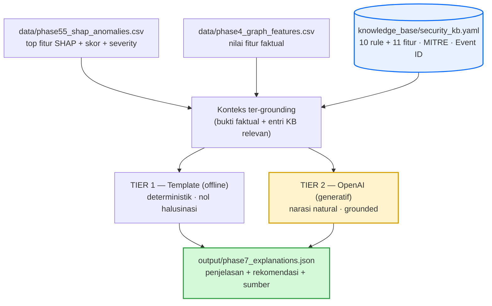

# Phase 7 — Anomaly Explainer (Penjelasan Anomali yang Dapat Dibaca Manusia)

Dokumen desain untuk **Phase 7**: mengubah output deteksi anomali (skor + atribusi SHAP) menjadi **penjelasan berbahasa manusia yang grounded** ke pengetahuan keamanan. Ini menjawab arahan dosen: *"jelajahi AI generatif atau basis pengetahuan berbasis dokumen untuk memperkaya Rule-Based Knowledge Engine demi penjelasan anomali yang dapat dibaca manusia."*

> Konsep penggabungan rule + XAI: [HYBRID_REASONING.md](HYBRID_REASONING.md). Alur pipeline: [ALUR_PROJECT.md](ALUR_PROJECT.md). Knowledge base: [`../knowledge_base/security_kb.yaml`](../knowledge_base/security_kb.yaml). Implementasi: [`../phase7_explainer.py`](../phase7_explainer.py).

---

## 1. Motivasi

Output SHAP saat ini berhenti pada **label fitur singkat** (mis. "Sering lockout"). Seorang analis butuh lebih: *apa artinya, kenapa berbahaya, teknik serangan apa, apa yang harus dilakukan* — dengan sumber yang dapat dipertanggungjawabkan. Phase 7 menambahkan **lapis penalaran** di atas SHAP yang menerjemahkan atribusi numerik menjadi narasi naratif + rekomendasi + sitasi.

---

## 2. Arsitektur



**Dua tier yang saling melengkapi:**

| Tier | Mesin | Sifat | Kapan dipakai |
| --- | --- | --- | --- |
| **Tier 1** | Template berbasis KB | Deterministik, **nol halusinasi**, offline | Fondasi yang selalu jalan; jaring pengaman |
| **Tier 2** | LLM **OpenAI** | Narasi natural & luwes | Bila `OPENAI_API_KEY` tersedia; pengayaan generatif |

LLM **hanya merangkai** fakta + entri KB yang diberikan — tidak mengarang.

---

## 3. Knowledge Base (sumber pengetahuan)

File: [`../knowledge_base/security_kb.yaml`](../knowledge_base/security_kb.yaml) — **10 rule + 11 fitur**, tiap entri berisi: deskripsi, kondisi/threshold, kenapa berbahaya, kemungkinan penyebab, **MITRE ATT&CK**, **Windows Event ID**, rekomendasi, dan **sumber**.

**Kredibilitas sumber (wajib):**

- **MITRE ATT&CK** — terverifikasi dari `attack.mitre.org` (T1110, T1078, T1098, T1021, T1133, T1003, T1552, T1078.002).
- **Threshold rule** — diambil langsung dari kode `neo4j_phase3_rules.py`.
- **Event ID Windows** — mengacu Microsoft Learn (disarankan spot-check sebelum publikasi).

---

## 4. Alur kerja

1. Ambil anomali teratas dari `phase55_shap_anomalies.csv` (top fitur + skor + severity).
2. Gabung nilai fitur faktual dari `phase4_graph_features.csv` (mis. `lockout_count=12693`).
3. Untuk tiap top fitur SHAP → tarik entri KB fitur + rule terkait.
4. Rangkai **konteks ter-grounding** = bukti faktual + entri KB.
5. Hasilkan penjelasan:
   - **Tier 1**: isi template dari KB (deterministik).
   - **Tier 2**: kirim konteks ke OpenAI → narasi JSON terstruktur.
6. Simpan ke `output/phase7_explanations.json`.

**Skema output (Tier 2):** `ringkasan · penjelasan · bukti · rekomendasi · sumber[]`.

**Contoh hasil (Tier 1, nyata):**

```text
mti.admin — severity CRITICAL, skor 0.640
- Penyebab utama: Sering lockout (lockout_count = 12693)
  - Mengapa berbahaya: Lockout beruntun adalah efek khas brute-force / kredensial usang.
  - MITRE: T1110 Brute Force
  - Event ID: 4740 (account lockout), 4625 (failed logon)
  - Rekomendasi: Telusuri sumber autentikasi pemicu lockout; reset kredensial; cek service account.
  - Sumber: README (R008); MITRE T1110; MS Learn — Account Lockout
```

---

## 5. Grounding & anti-halusinasi

| Risiko | Mitigasi |
| --- | --- |
| LLM mengarang sebab/angka | Prompt sistem mengunci: **hanya** fakta BUKTI + entri KB; nilai faktual dipakai apa adanya |
| Sitasi palsu | Sumber hanya dari KB (MITRE/Event ID terverifikasi); LLM diminta selalu mencantumkan sumber |
| Output tak konsisten | `response_format=json_object` + `temperature=0.2`; skema field tetap |
| LLM tak tersedia / gagal | Fallback otomatis ke **Tier 1** (deterministik) |

---

## 6. Setup & penggunaan

```bash
pip install openai python-dotenv        # openai sudah terpasang di lingkungan ini
cp .env.example .env                     # lalu isi OPENAI_API_KEY=sk-...
python phase7_explainer.py
```

Konfigurasi `.env` (lihat [`../.env.example`](../.env.example)):

```text
OPENAI_API_KEY=sk-...
OPENAI_MODEL=gpt-4o-mini    # opsional; mis. gpt-4o untuk kualitas lebih tinggi
```

`.env` sudah **gitignored** — API key tidak akan ter-commit. Tanpa key, hanya **Tier 1** yang berjalan (tetap menghasilkan penjelasan + sumber).

---

## 7. Evaluasi (untuk skripsi)

Karena "keterbacaan" sulit diukur otomatis, gunakan kombinasi:

| Dimensi | Cara ukur |
| --- | --- |
| **Faithfulness** (setia ke bukti) | Cek tiap klaim narasi punya dukungan di BUKTI/KB; hitung rasio klaim ter-dukung |
| **Akurasi sumber** | Verifikasi MITRE ID/Event ID yang dikutip benar (vs KB terverifikasi) |
| **Keterbacaan** | Rating pakar/analis (skala Likert) atau rubrik; opsional *LLM-as-judge* sebagai pra-saring |
| **Kegunaan rekomendasi** | Penilaian apakah aksi yang disarankan dapat ditindaklanjuti |

**Reproducibility:** catat model + versi + prompt; `temperature=0.2` mengurangi variansi (tidak menghilangkan). Untuk hasil tetap, simpan output yang sudah diverifikasi.

---

## 8. Keterbatasan & future work

- **Tier 2 stokastik** — perlu verifikasi manusia sebelum dipakai operasional/dipublikasikan.
- **Event ID** belum diverifikasi satu per satu (mengacu MS Learn) — spot-check disarankan.
- **KB statis** — perlu pemeliharaan saat rule/fitur berubah.
- **Future work:** retrieval (RAG) bila KB membesar; validasi label pakar; evaluasi faithfulness otomatis; dukungan multi-bahasa.
